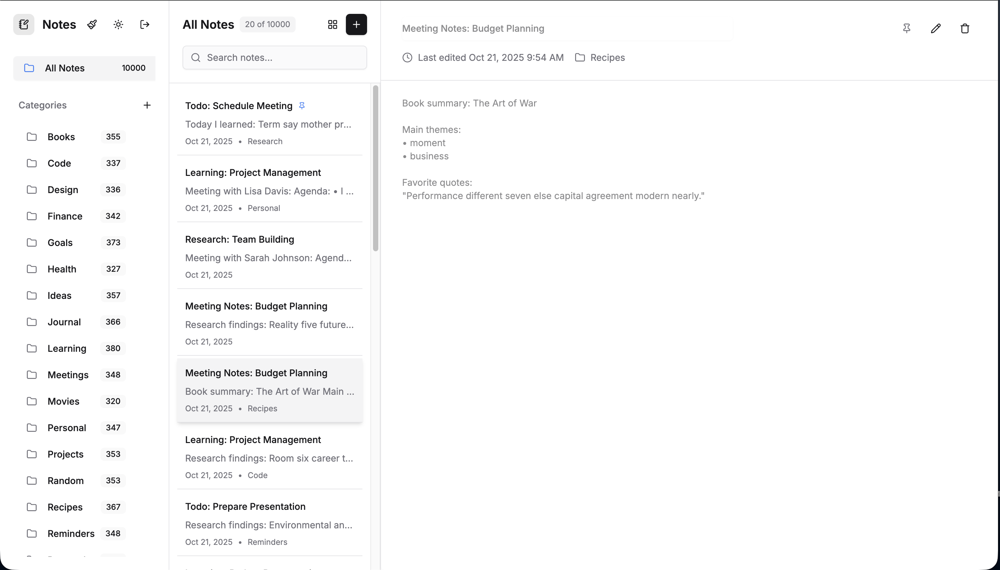
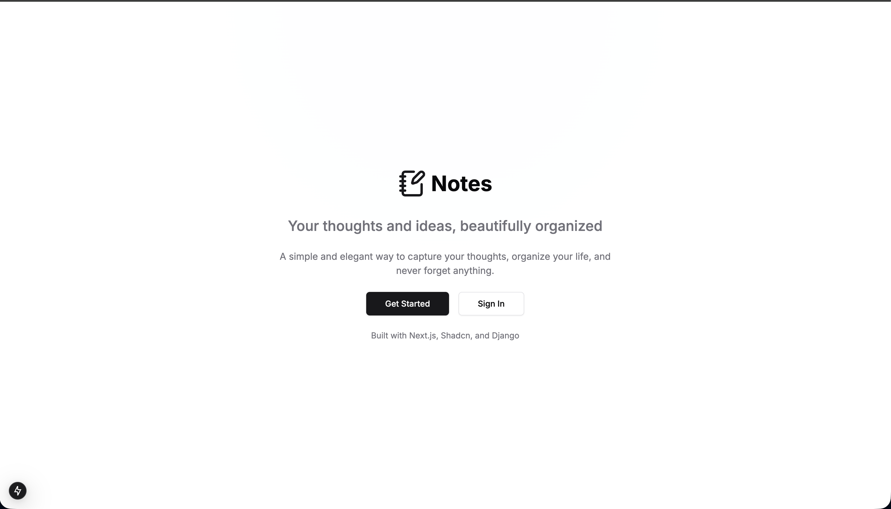
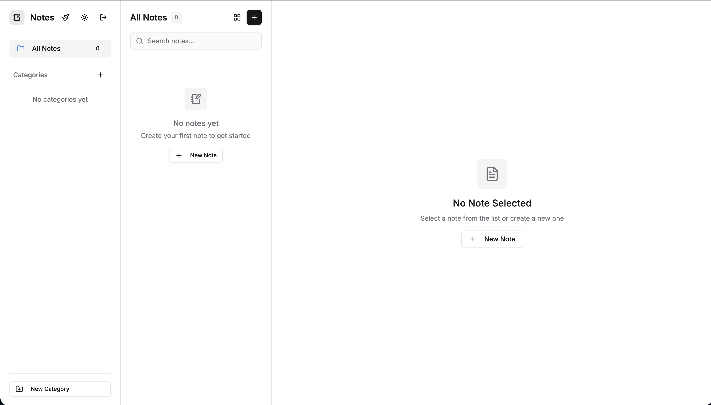

# Notes Application

A modern, full-stack notes application built with Next.js, Django, and PostgreSQL. Features infinite scrolling, real-time updates, and a beautiful, responsive interface.



## 🚀 Features

### **Core Functionality**

- ✅ **Create, Edit, Delete Notes** - Full CRUD operations with rich text content
- ✅ **Category Management** - Organize notes with custom categories
- ✅ **Search & Filter** - Find notes quickly with real-time search
- ✅ **Pin Notes** - Mark important notes for quick access
- ✅ **Infinite Scrolling** - Seamlessly browse through thousands of notes
- ✅ **Real-time Updates** - Instant UI updates with optimistic updates

### **User Experience**

- 🎨 **Modern UI** - Clean, responsive design with dark/light themes
- ⚡ **Fast Performance** - Optimized for large datasets (10,000+ notes)
- 📱 **Responsive Design** - Works perfectly on desktop and mobile
- 🔄 **Smooth Animations** - Framer Motion animations for delightful interactions
- 🎯 **Intuitive Navigation** - Easy-to-use interface with keyboard shortcuts

### **Technical Features**

- 🔐 **JWT Authentication** - Secure user authentication and authorization
- 📊 **Pagination** - Efficient data loading with backend pagination
- 🗄️ **Database Seeding** - Pre-populated with realistic test data
- 🐳 **Docker Support** - Easy development and deployment setup
- 🚀 **Production Ready** - Optimized for both development and production

## 🏗️ Architecture

### **Frontend (Next.js)**

- **Framework**: Next.js 14 with App Router
- **Styling**: Tailwind CSS with shadcn/ui components
- **State Management**: React Query for server state, Zustand for client state
- **Animations**: Framer Motion for smooth transitions
- **Authentication**: JWT token-based authentication

### **Backend (Django)**

- **Framework**: Django 5.1.5 with Django REST Framework
- **Database**: PostgreSQL with optimized queries
- **Authentication**: JWT (Simple JWT) for secure API access
- **Caching**: Redis for improved performance
- **Pagination**: Custom pagination for efficient data loading

### **Infrastructure**

- **Database**: PostgreSQL with connection pooling
- **Cache**: Redis for session and data caching
- **Containerization**: Docker and Docker Compose
- **Development**: Hot reload and automatic setup

## 📁 Project Structure

```
Notes/
├── client/                 # Next.js frontend
│   ├── src/
│   │   ├── app/           # App Router pages
│   │   ├── components/    # Reusable UI components
│   │   ├── services/      # API service layer
│   │   └── store/         # State management
│   └── package.json
├── server/                 # Django backend
│   ├── config/            # Django settings and configuration
│   ├── notes/             # Notes app with models, views, serializers
│   ├── accounts/          # User authentication and management
│   ├── requirements.txt   # Python dependencies
│   └── seed_data.py      # Database seeding script
├── docker-compose.yml     # Production Docker setup
├── docker-compose.dev.yml # Development Docker setup
└── README-Docker.md       # Docker setup documentation
```

## 🚀 Quick Start

### **Prerequisites**

- Docker and Docker Compose
- Git

### **Development Setup**

1. **Clone the repository**

   ```bash
   git clone <repository-url>
   cd Notes
   ```

2. **Start the development environment**

   ```bash
   docker compose -f docker-compose.dev.yml up --build
   ```

3. **Access the application**
   - Frontend: http://localhost:3000
   - Backend API: http://localhost:8000
   - Admin Panel: http://localhost:8000/admin



### **Default Credentials**

- **Username**: `admin`
- **Password**: `admin123`

## 🎯 Usage

### **Getting Started**

1. **Login** with the default credentials or create a new account
2. **Browse Notes** - Your notes are automatically loaded with infinite scrolling
3. **Create Notes** - Click the "+" button to create new notes
4. **Organize** - Use categories to organize your notes
5. **Search** - Use the search bar to find specific notes
6. **Pin Important Notes** - Click the pin icon to mark important notes



### **Key Features**

#### **Infinite Scrolling**

- Scroll down to automatically load more notes
- No manual pagination required
- Optimized for large datasets

#### **Category Management**

- Create custom categories with the "+" button
- See note counts for each category
- Filter notes by category

#### **Search & Filter**

- Real-time search across titles and content
- Filter by categories
- Sort by date, title, or pinned status

#### **Note Management**

- Rich text content with formatting
- Pin important notes to the top
- Edit and delete with confirmation dialogs
- Automatic saving

## 🛠️ Development

### **Frontend Development**

```bash
cd client
npm install
npm run dev
```

### **Backend Development**

```bash
cd server
pip install -r requirements.txt
python manage.py runserver
```

### **Database Management**

```bash
# Create migrations
python manage.py makemigrations

# Apply migrations
python manage.py migrate

# Seed database with test data
python manage.py shell < seed_data.py
```

### **Adding New Features**

1. **Backend**: Add models, serializers, and views in the appropriate Django app
2. **Frontend**: Create components and update the API service layer
3. **Testing**: Test with the seeded data (10,000+ notes)

## 🐳 Docker Deployment

### **Development**

```bash
docker compose -f docker-compose.dev.yml up --build
```

### **Production**

```bash
docker compose up --build
```

### **Environment Variables**

- `POSTGRES_DB`: Database name
- `POSTGRES_USER`: Database user
- `POSTGRES_PASSWORD`: Database password
- `REDIS_URL`: Redis connection URL

## 📊 Performance

### **Optimizations**

- **Infinite Scrolling**: Only loads visible notes + buffer
- **Backend Pagination**: Efficient database queries
- **Redis Caching**: Fast data retrieval
- **Optimistic Updates**: Instant UI feedback
- **Lazy Loading**: Components load as needed

### **Scalability**

- **Database**: Optimized for 10,000+ notes
- **Caching**: Redis for session and data caching
- **Pagination**: Handles large datasets efficiently
- **Memory**: Efficient data loading and cleanup

## 🔧 Configuration

### **Backend Settings**

- **Database**: PostgreSQL with connection pooling
- **Cache**: Redis for improved performance
- **Authentication**: JWT with configurable expiration
- **CORS**: Configured for frontend communication

### **Frontend Settings**

- **API Base URL**: Configurable via environment variables
- **Theme**: Dark/light mode support
- **Animations**: Framer Motion for smooth transitions

## 🧪 Testing

### **Test Framework**

The application uses **pytest** with comprehensive test coverage for:

- **API Endpoints** - All REST API endpoints tested
- **Authentication** - User registration, login, and profile management
- **Authorization** - User access control and permissions
- **Data Validation** - Input validation and error handling
- **Business Logic** - Core application functionality

### **Running Tests**

#### **Install Test Dependencies**

```bash
cd server
pip install -r requirements.txt
```

#### **Run All Tests**

```bash
# Using pytest (recommended)
pytest

# With coverage report
pytest --cov=. --cov-report=html

# Run specific test files
pytest notes/test_notes_api.py
pytest accounts/test_auth_api.py
```

#### **Test Categories**

```bash
# Run only unit tests
pytest -m unit

# Run only integration tests
pytest -m integration

# Skip slow tests
pytest -m "not slow"
```

### **Test Coverage**

- **Notes API**: 15+ test cases covering CRUD operations, pagination, search, and filtering
- **Categories API**: 12+ test cases covering category management and validation
- **Authentication API**: 18+ test cases covering registration, login, and profile management
- **Authorization**: Tests for user isolation and access control
- **Edge Cases**: Error handling, validation, and boundary conditions

### **Database Seeding**

The application comes with a comprehensive seeding script that creates:

- **10,000+ Notes** with realistic content
- **20 Categories** with proper note distribution
- **Rich Content** including meeting notes, research, and personal entries

### **Test Data**

- **Meeting Notes**: Professional meeting documentation
- **Research**: Academic and professional research notes
- **Personal**: Journal entries and personal thoughts
- **Learning**: Educational content and tutorials

## 📝 API Documentation

### **Authentication**

- `POST /api/v1/auth/token/` - Login
- `POST /api/v1/auth/refresh/` - Refresh token
- `POST /api/v1/auth/register/` - User registration

### **Notes**

- `GET /api/v1/notes/` - List notes (paginated)
- `POST /api/v1/notes/` - Create note
- `GET /api/v1/notes/{id}/` - Get note details
- `PUT /api/v1/notes/{id}/` - Update note
- `DELETE /api/v1/notes/{id}/` - Delete note

### **Categories**

- `GET /api/v1/categories/` - List categories
- `POST /api/v1/categories/` - Create category
- `DELETE /api/v1/categories/{id}/` - Delete category

## 🤝 Contributing

1. Fork the repository
2. Create a feature branch
3. Make your changes
4. Test thoroughly
5. Submit a pull request

## 📄 License

This project is licensed under the MIT License.

## 🆘 Support

For issues and questions:

1. Check the Docker setup documentation
2. Review the API documentation
3. Test with the seeded data
4. Check the browser console for errors

---

**Built with ❤️ using Next.js, Django, and modern web technologies.**
